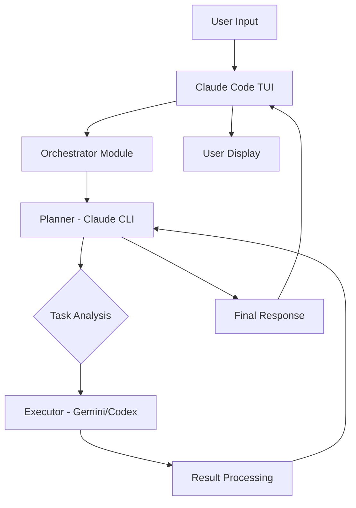

# Claude Code TUI Orchestration Architecture

## Overview

This architecture leverages Claude Code's robust TUI infrastructure as the central orchestration platform, eliminating TTY/PTY issues while providing seamless integration between planning and execution LLMs.

## Core Components

### 1. User Interface Layer
- **Claude Code TUI**: Primary interface for all user interactions
- Handles terminal management, input/output streams, and display rendering
- No modifications needed - uses existing Claude Code installation

### 2. Orchestration Layer

#### 2.1 Planner Module (Claude)
- **Role**: Task analysis, decomposition, and strategic planning
- **Interface**: Claude CLI with JSON output
- **Command**: `claude --print --output-format=json --dangerously-skip-permissions`
- **Responsibilities**:
  - Understand user requirements
  - Create execution plans
  - Validate executor results
  - Maintain conversation context

#### 2.2 Executor Module (Gemini/Codex)
- **Role**: Code generation and task execution
- **Options**:
  - **Gemini CLI**: `gemini "prompt" --output-format json`
  - **Codex CLI**: `codex proto` (protocol mode)
- **Responsibilities**:
  - Execute specific coding tasks
  - Return structured results
  - Handle file operations

### 3. Communication Layer

#### 3.1 JSON-RPC Protocol
```javascript
{
  "jsonrpc": "2.0",
  "method": "execute",
  "params": {
    "task": "implement function",
    "context": {...}
  },
  "id": 1
}
```

#### 3.2 MCP (Model Context Protocol) Integration
- Enables bi-directional communication
- Tool discovery and registration
- Session state management

### 4. Process Management

#### 4.1 Subprocess Architecture
```javascript
class OrchestratorCore {
  constructor() {
    this.planner = new ClaudeCLI();
    this.executor = new GeminiCLI();
    this.messageQueue = new Queue();
  }
}
```

#### 4.2 Stream Handling
- **stdin/stdout**: Primary communication channel
- **stderr**: Error and diagnostic information
- **Buffering**: Handles large payloads without deadlock

## Data Flow



## Key Design Decisions

### 1. Why Claude Code as Foundation?
- Solved TTY/PTY compatibility issues
- Robust session management
- Built-in MCP support
- Active development and maintenance

### 2. Why JSON-RPC?
- Structured communication
- Error handling built-in
- Request/response correlation
- Industry standard protocol

### 3. Why Separate Planner/Executor?
- Specialized models for specific tasks
- Cost optimization (Claude for planning, Gemini for execution)
- Flexibility to swap executors
- Clear separation of concerns

## State Management

### Session State
```javascript
{
  "sessionId": "uuid",
  "plannerState": {
    "conversationHistory": [],
    "currentPlan": {},
    "context": {}
  },
  "executorState": {
    "tasksCompleted": [],
    "currentTask": {},
    "resources": {}
  }
}
```

### Persistence
- Claude Code handles session persistence
- State checkpointing for recovery
- Task queue persistence

## Error Handling

### Failure Modes
1. **Executor Timeout**: Fallback to alternative executor
2. **JSON Parse Error**: Request retry with validation
3. **Process Crash**: Automatic restart with state recovery
4. **Network Issues**: Local queuing and retry

### Recovery Strategy
```javascript
async function executeWithRecovery(task) {
  try {
    return await executor.execute(task);
  } catch (error) {
    if (error.type === 'TIMEOUT') {
      return await fallbackExecutor.execute(task);
    }
    // Additional recovery logic
  }
}
```

## Security Considerations

1. **Input Validation**: All JSON payloads validated against schema
2. **Sandboxing**: Executor runs with limited permissions
3. **API Key Management**: Environment variables, never in code
4. **Audit Logging**: All operations logged for review

## Performance Optimization

1. **Parallel Execution**: Multiple executor instances when needed
2. **Response Caching**: Cache frequently used responses
3. **Stream Processing**: Handle large outputs incrementally
4. **Connection Pooling**: Reuse CLI processes

## Extensibility

### Adding New Executors
1. Implement `ExecutorInterface`
2. Register in executor factory
3. Update configuration

### Custom Tools
1. Create MCP server
2. Register with Claude Code
3. Available to both planner and executor

## Deployment Architecture

### Local Development
```
claude-code (TUI)
    ├── orchestrator.js
    ├── planner-claude.js
    ├── executor-gemini.js
    └── mcp-servers/
```

### Production Considerations
- Process monitoring with PM2
- Log aggregation
- Metrics collection
- Health checks

## Future Enhancements

1. **Multi-Executor Support**: Route tasks to specialized executors
2. **Web Interface**: Optional web UI alongside TUI
3. **Distributed Execution**: Scale executors horizontally
4. **Plugin System**: Dynamic executor loading
5. **ML-based Routing**: Intelligent task routing based on performance